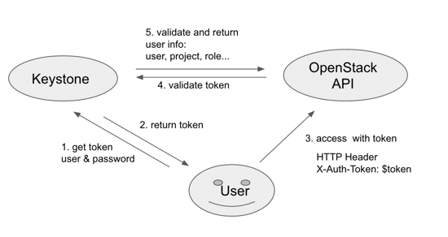
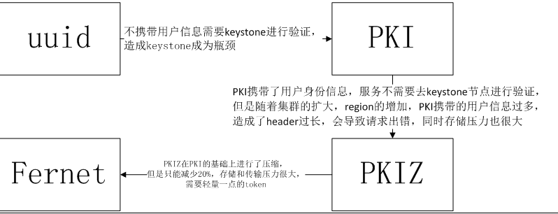
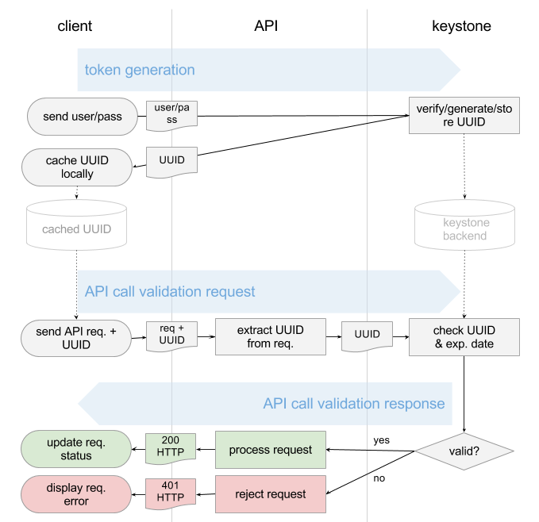
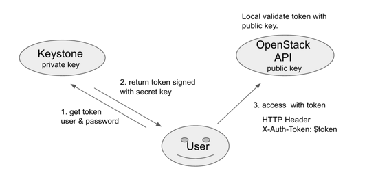
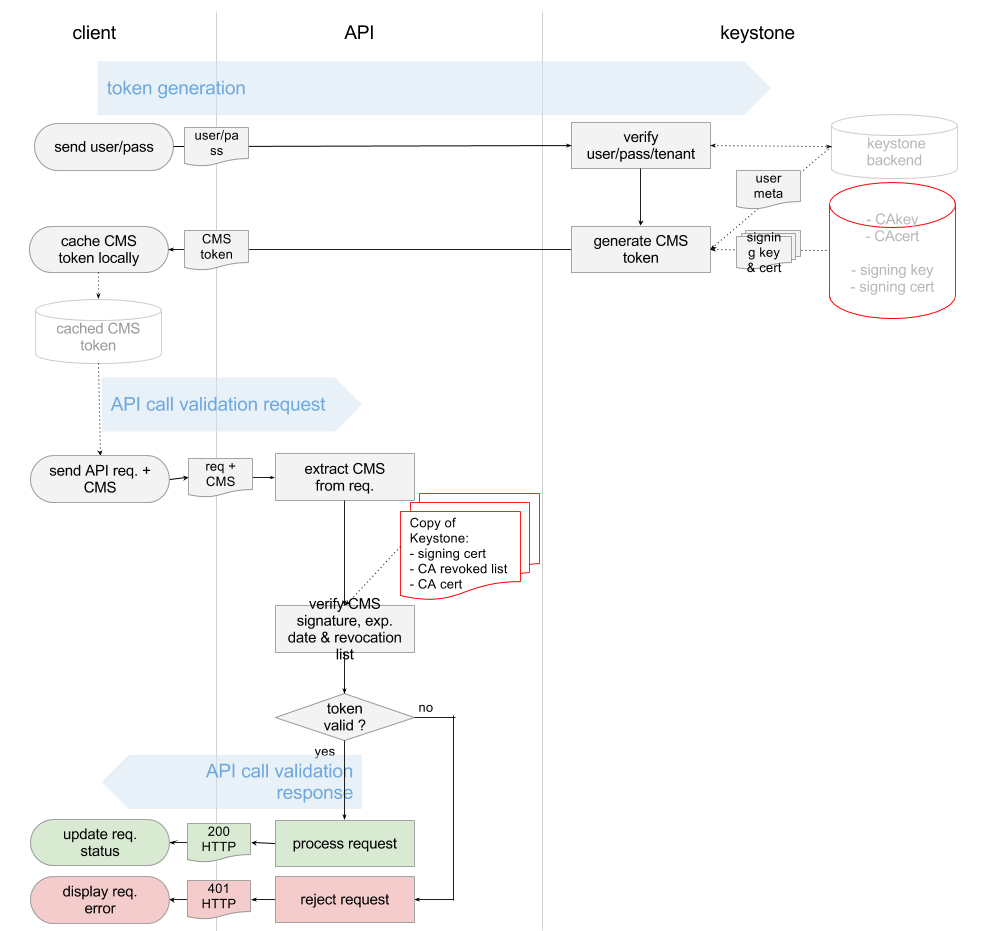
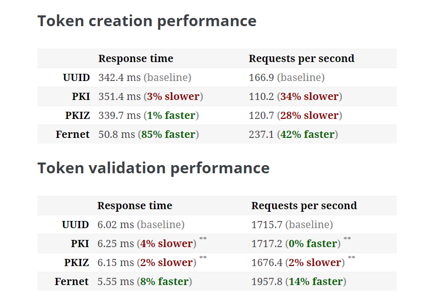
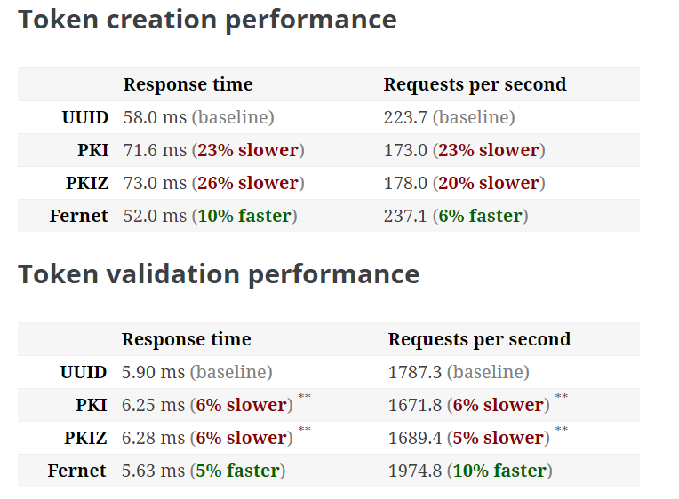

#Keystone token生成方式分析

keystone token的生成方式有4种：uuid、PKI、PKIZ、Fernet。

下面分别从格式、信息量、在keystone中鉴权的流程以及优势和劣势进行分析，由于环境问题没有做实验，引用了一些其他博文的实验数据，以做参考。
##一般情况下token的验证流程
首先讲一下普通情况下token的验证流程，如下图所示：
	
	（1）	用户向keystone发送用户名和密码
	（2）	Keystone验证用户身份，生成并返回token
	（3）	用户向服务发送请求，携带从keystone返回的token作为身份凭证。
	（4）	服务收到用户的含有token的请求，向keystone发送请求进行验证该token的有效性。
	（5）	Keystone验证该token有效性，若有效：返回用户信息和相应的角色信息等；无效： forbidden error。
 

 图1

##四种token的生成方式演化过程
 

###一、	Uuid

1、	格式

UUID token是长度固定为32 Byte的随机字符串，由 uuid.uuid4().hex 生成。

	def _get_token_id(self, token_data):
	    return uuid.uuid4().hex

2、	信息量

普通的字符串，没有意义的信息量。例如：144d8a99a42447379ac37f78bf0ef608

3、	Keystone鉴权流程

和图1流程一样：需要services发消息给keystone验证token有效性，并返回用户信息和用户角色信息。
当访问量大时，步骤（4）、（5）会使keystone成为瓶颈。
 

4、	优势

	（1）	由生成的函数可以看出，生成方式简单，复杂度低
	（2）	Token长度短，只有32Byte，易于存储，且不浪费带宽。
5、	劣势

	（1）	存储于数据库中，由于token增长很快，每次鉴权时需要去数据库中进行查找和验证token，因此数据量大时，数据库操作时间增大，造成keystone成为瓶颈，没有自动清理keystone数据库的机制，需要手动清理无效token。
	（2）	Token没有加密，不安全。

###二、	PKI

PKI( Public Key Infrastructrue ) token 在 G 版本运用而生，和 UUID 相比，PKI token 携带更多用户信息的同时还附上了数字签名，以支持本地认证，从而避免了步骤 4。因为 PKI token 携带了更多的信息，这些信息就包括 service catalog，随着 OpenStack 的 Region 数增多，service catalog 携带的 endpoint 数量越多，PKI token 也相应增大，很容易超出 HTTP Server 允许的最大 HTTP Header(默认为 8 KB)，导致 HTTP 请求失败。

1、格式

Token的生成函数：

	def _get_token_id(self, token_data):
	    try:
	        token_json = jsonutils.dumps(token_data, cls=utils.PKIEncoder)
	        token_id = str(cms.cms_sign_token(token_json,
	                                          CONF.signing.certfile,
	                                          CONF.signing.keyfile))
	        return token_id
PKI 的本质就是基于数字签名，Keystone 用私钥对token进行数字签名，各个 API server 用公钥在本地验证该token，因此就可以省去步骤4。

Token的数据格式如下所示：

	{
	  "token": {
	    "methods": [ "password" ],
	    "roles": [{"id": "5642056d336b4c2a894882425ce22a86", "name": "admin"}],
	    "expires_at": "2015-12-25T09:57:28.404275Z",
	    "project": {
	      "domain": { "id": "default", "name": "Default"},
	      "id": "144d8a99a42447379ac37f78bf0ef608", "name": "admin"},
	    "catalog": [
	      {
	        "endpoints": [
	          {
	            "region_id": "RegionOne",
	            "url": "http://controller:5000/v2.0",
	            "region": "RegionOne",
	            "interface": "public",
	            "id": "3837de623efd4af799e050d4d8d1f307"
	          },
	          ......
	      ]}],
	    "extras": {},
	    "user": {
	      "domain": {"id": "default", "name": "Default"},
	      "id": "1552d60a042e4a2caa07ea7ae6aa2f09", "name": "admin"},
	    "audit_ids": ["ZCvZW2TtTgiaAsVA8qmc3A"],
	    "issued_at": "2015-12-25T08:57:28.404304Z"
	  }
	}
2、	信息量

通过上面的token可以看出，token包含了用户信息以及用户的catalog信息。

token长度大，随着region的增加，catalog不断增大，PKI的token会进一步增大，而token是在header中一起进行请求的，因此会超过header最长长度限制。

3、	Keystone鉴权流程

由于token中包含了用户信息以及用户的catalog，就可以通过公钥在本地进行解密，从而获取用户信息，进行鉴权，省去步骤4。

 
 
4、优势

	（1） 在节点进行解密认证，keystone的带宽不再成为瓶颈。 
	（2） 加密操作更加安全。

5、劣势

	（1） PKI进行加密计算，复杂度高。
	（2） 在各个节点上均需要进行秘钥的存储。
	（3）由于token信息中携带了用户信息和catalog信息，导致token很大，超过header最大的限度。

三、	PKIZ

由于PKI方式，导致token过长，因此产生了PKIZ方式，是在PKI的生成方式基础上使用zlib进行压缩。

1、	格式

	def _get_token_id(self, token_data):
	        try:
	            token_json = jsonutils.dumps(token_data, cls=utils.PKIEncoder)
	            token_id = str(cms.pkiz_sign(token_json,
	                                         CONF.signing.certfile,
	                                         CONF.signing.keyfile))

由上可知，该token和PKI生成的token包含信息一致，使用cms.pkiz_sign函数。

	def pkiz_sign( … ):
	     compressed = zlib.compress(signed, compression_level)
	     encoded = PKIZ_PREFIX + base64.urlsafe_b64encode(   #PKIZ_PREFIX =pkiz_compressed).decode('utf-8')
	     return encoded

由上可知，pkiz_sign函数是在做zlib压缩，从而减小token长度。

2、	信息量

和PKI一致，包含user data、catalog data、metadata。

3、	Keystone鉴权方式

与PKI方式的鉴权一样，都是在services node上进行鉴权，不依赖于keystone。

4、	优势

PKI的优势基础上，增加了减少了长度。

5、	劣势

虽然减少了token长度，但是减小程度并不理想。

四、	Fernet

1、	格式

包含了用户信息，但是不含catalog信息。长度在200Byte左右。使用AES进行加密。

	def create_token(self, user_id, expires_at, audit_ids, methods=None,
	                 domain_id=None, project_id=None, trust_id=None,
	                 federated_info=None):
	    """Given a set of payload attributes, generate a Fernet token."""
	
	    if trust_id:
	        version = TrustScopedPayload.version
	        payload = TrustScopedPayload.assemble(
	            user_id,
	            methods,
	            project_id,
	            expires_at,
	            audit_ids,
	            trust_id)
	    ...
	    versioned_payload = (version,) + payload
	    serialized_payload = msgpack.packb(versioned_payload)
	    token = self.pack(serialized_payload)
	return token

生成结果如下所示：

gAAAAABWfX8riU57aj0tkWdoIL6UdbViV-632pv0rw4zk9igCZXgC-sKwhVuVb-wyMVC9e5TFc 7uPfKwNlT6cnzLalb3Hj0K3bc1X9ZXhde9C2ghsSfVuudMhfR8rThNBnh55RzOB8YTyBnl9MoQ XBO5UIFvC7wLTh_2klihb6hKuUqB6Sj3i_8

2、	信息量

含有用户的基本信息：user_id，project_id，domain_id，methods，expires_at 等信息，不含 service_catalog，所以 region 的数量并不影响它的大小。

3、	Keystone鉴权方式

与uuid方式相同，需要将token发送给keyston进行验证。但是不需要进行sql存储，只存储于内存中。

4、	优势
	
	（1）不需要进行数据库存储，减少了磁盘IO。因为使用对称加密算法，维护的是一个公共的key repository。所以当涉及到多个keystone node时，uuid、PKI、PKIZ都需要进行数据库存储token，或者使用memcache不断进行keystone node之间的内存数据同步，这些都是非常消耗带宽和存储资源的。若使用fernet方式，由于每个keystone node都使用同一个key repository，所以可以在不同的keystone node上进行验证，而无需进行存储和数据同步。

5、	劣势

	（1）需要向keystone进行token验证，keystone压力比较大。

##性能测试：（摘自附录5的结果）
主要有两个过程：token create 和token validate
在两个环境的测试，多机和单机
1、多个keystone（模拟多region）
 

2、单keystone（模拟单region）
 

综上，Fernet是为多个region的环境设计的，不用数据库存储，在单机环境下时，与使用memcache的uuid理论上功能一致，验证时的步骤一致。多region时，由于uuid要使用数据库和做token同步，故比Fernet效果差。

PKI和PKIZ可以使其他node每次不依赖于keystone做验证，解决了keystone瓶颈的问题，但是随着region的增加，catalog增大，token过长，会超出header最大长度的限制。

#参考文献：
【1】http://blog.csdn.net/miss_yang_cloud/article/details/49633719

【2】http://lbragstad.com/fernet-tokens-and-key-rotation/

【3】http://www.tuicool.com/articles/jQJNFrn

【4】http://dalida.blogbus.com/tag/fernet/

性能测试

【5】http://dolphm.com/benchmarking-openstack-keystone-token-formats/

【6】http://dolphm.com/openstack-keystone-fernet-tokens/  

【7】http://docs.openstack.org/admin-guide/keystone-fernet-token-faq.html

【8】http://www.symantec.com/connect/articles/openstack-keystone-performance-testing
